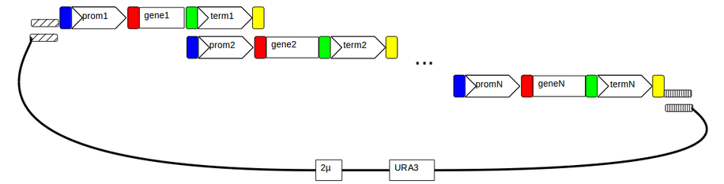

#Pathway {name}

This notebook describes the assembly of {length} single gene expression cassettes into a single pathway. 
Notebooks describing the single gene expression vectors are linked at the end of this document as are notebooks 
describing pYPKa promoter, gene and terminator vectors. Specific primers needed are also listed below.

The [pydna](https://pypi.python.org/pypi/pydna/) package is imported in the code cell below. 
There is a [publication](http://www.biomedcentral.com/1471-2105/16/142) describing pydna as well as
[documentation](http://pydna.readthedocs.org/en/latest/) available online. 
Pydna is developed on [Github](https://github.com/BjornFJohansson/pydna). 

    import pydna

Initiate the standard primers needed to amplify each cassette.
The first cassette in the pathway is amplified with standard
primers 577 and 778, the last with
775 and 578 and all others with 775 and 778.
Standard primers are listed [here](primers.fasta).

    p = {{ x.id: x for x in pydna.parse("primers.fasta") }}

The backbone vector is linearized with [EcoRV](http://rebase.neb.com/rebase/enz/EcoRV.html).

    from Bio.Restriction import EcoRV

    pYPKpw = pydna.read("pYPKpw.gb")

The assembly_fragments variable holds the list of DNA fragments to
be assembled.

    assembly_fragments = [ pYPKpw.linearize(EcoRV) ]

The expression cassettes comes from a series of single gene expression vectors 
held in the template_vectors list.

    cas_vectors ='''
{cas_vectors}'''.splitlines()

    template_vectors = [pydna.read(v.strip()) for v in cas_vectors if v.strip()]

    template_vectors

The first cassette in the pathway is amplified with standard primers 577 and 778

    assembly_fragments.append( pydna.pcr( p['577'], p['778'],  template_vectors[0] ) )

Cassettes in the middle cassettes are amplified with standard primers 775 and 778.

    assembly_fragments.extend( pydna.pcr( p['775'], p['778'], v) for v in template_vectors[1:-1] ) 

The last cassette in the pathway is amplified with standard primers 775 and 578

    assembly_fragments.append( pydna.pcr( p['775'], p['578'], template_vectors[-1] ) )

Cassettes and plasmid backbone are joined by homologous recombination in a Saccharomyces cerevisiae ura3 host
which selects for the URA3 gene in pYPKpw.

    asm = pydna.Assembly( assembly_fragments, limit=167-47-10)
    asm

Normally, only one circular product should be formed since the 
homology limit is quite large (see cell above). More than one 
circular products might indicate an incorrect strategy. 
The largest recombination product is chosen as candidate for 
the {name} pathway.

    candidate = asm.circular_products[0]

This assembly figure shows how the fragments came together.
            
    candidate.figure()

The final pathway is synchronized to the backbone vector. This means that
the plasmid origin is shifted so that it matches the original.

    pw = candidate.synced(pYPKpw)

Calculate cseguid checksum for the resulting plasmid for future reference.
This is a seguid checksum that uniquely describes a circular double stranded 
sequence.

    pw.cseguid()

The file is given a name based on the sequence of expressed genes.

    pw.locus = "pw"
    pw.definition = "{name}"

Stamp sequence with cseguid checksum. This can be used to verify the 
integrity of the sequence file.

    pw.stamp()

Write sequence to a local file.

    pw.write("{name}.gb")

#[Download]({name}.gb)

    import pydna

    reloaded = pydna.read("{name}.gb")

    reloaded.verify_stamp()

###New Primers needed for assembly.

This list contains all needed primers that are not in the standard primer list above.

{primer_list}

###New pYPK0_tp_gene_tp clones needed for assembly.

Hyperlinks to notebook files describing the singlke gene expression plasmids needed for the assembly.

{tp_gene_tp_links}

###New pYPKa clones needed for assembly.

Hyperlinks to notebook files describing the pYPKa plasmids needed for the assembly of the single gene clones listed above.

{pYPKa_clones}
	

