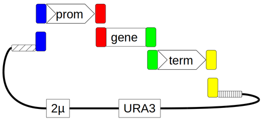

# pYPK0_{tpz}_{gene}_{tpe}

This notebook describes the assembly of the Saccaromyces cerevisiae 
single gene expression vector pYPK0_{tpz}_{gene}_{tpe}.

It is made by _in-vivo_ homologous recombination between three PCR products;
a promoter generated from a pYPK_Z vector, a gene from a pYPKa_A vector and 
a terminator from a pYPKa_E vector. The three PCR products are joined to
a linearized pYPKpw backbone vector that has the URA3 marker and a S. crevisiae 2 micron ori. 

The four linear DNA fragments are joined by homologous recombination in a Saccharomyces ura3 mutant.

The [pydna](https://pypi.python.org/pypi/pydna/) package is imported in the code cell below. 
There is a [publication](http://www.biomedcentral.com/1471-2105/16/142) describing pydna as well as
[documentation](http://pydna.readthedocs.org/en/latest/) available online. 
Pydna is developed on [Github](https://github.com/BjornFJohansson/pydna). 

    import pydna

Initiate the standard primers into a dictionary variable. The primers are read from [this](primers.fasta) file.

    p = {{ x.id: x for x in pydna.parse("primers.fasta") }}

The backbone vector is read from this file: [pYPKpw](pYPKpw.gb)

    pYPKpw = pydna.read("pYPKpw.gb")

The backbone vector is linearized by digestion with [EcoRV](http://rebase.neb.com/rebase/enz/EcoRV.html)

    from Bio.Restriction import EcoRV

    pYPK_EcoRV = pYPKpw.linearize(EcoRV)

The pYPKa E. coli plasmids from which the [promoter](pYPKa_Z_{tpz}.gb) and [terminator](pYPKa_E_{tpe}.gb) are PCR amplified 
are read into two variables below.

    promoter_template   = pydna.read("pYPKa_Z_{tpz}.gb")
    gene_template       = pydna.read("{gene}.gb")
    terminator_template = pydna.read("pYPKa_E_{tpe}.gb")

The construction of the two vector above are described in the [pYPKa_ZE_{tpz}](pYPKa_ZE_{tpz}.ipynb) notebooks.

The promoter was amplified with from a [pYPKa_Z_{tpz}](pYPKa_Z_{tpz}.gb).

    prom = pydna.pcr( p['577'], p['567'], promoter_template)

Primer tails are needed for the recombination with the gene. The tails are designed to 
provide 33 bp of homology to the promoter and terminator PCR products.
               
    fp_tail = "tgcccactttctcactagtgacctgcagccgacAA"
    rp_tail = "AAatcctgatgcgtttgtctgcacagatggCAC"

Primers with tails above are designed.

    fp, rp = pydna.cloning_primers(gene_template, fp_tail=fp_tail, rp_tail=rp_tail)

Primers are given the names below. These primers are included in the primer list in the end of the [pathway notebook](pw.ipynb) file.

    fp.id = "{gene}fw"
    rp.id = "{gene}rv"

Primers have the following sequences:

    print(fp.format("tab"))
    print(rp.format("tab"))

The gene was amplifed with the primers.

    gene = pydna.pcr( fp, rp, gene_template)

The terminator was amplified from  [pYPKa_E_{tpe}](pYPKa_E_{tpe}.gb).

    term = pydna.pcr( p['568'], p['578'], terminator_template)

The four linear DNA fragments are mixed and transformed
to a Saccharomyces cerevisiae ura3 mutant.

The fragments will be assembled by in-vivo homologous recombination:

    asm = pydna.Assembly( (pYPK_EcoRV, prom, gene, term), limit=31 )

    asm

The representation of the asm object above should normally indicate one circcular product only.  
More than one circular products might indicate an incorrect assembly strategy or might represent
by-products that might arise in the assembly process.  
The largest recombination product is chosen as candidate for the pYPK0_{tpz}_{gene}_{tpe} vector.

    candidate = asm.circular_products[0]

    candidate.figure()

The candidate vector is synchronized to the backbone vector. This means that
the plasmid origin is shifted so that it matches the original.

    result = candidate.synced(pYPKpw)

###Diagnostic PCR confirmation

The structure of the final vector is confirmed by two
separate PCR reactions, one for the promoter and gene and
one for the gene and terminator.

PCR using standard primers 577 and 467 to amplify promoter and gene.

    product = pydna.pcr( p['577'], p['467'], result)

A correct clone should give this size:

    print(len(product))

The promoter is missing from the assembly:

    print(len(product) - len(prom))

The gene is missing from the assembly:

    print(len(product) - len(gene))

PCR using standard primers 468 and 578 to amplify gene and terminator.

    product2 = pydna.pcr( p['468'], p['578'], result)

A correct clone should give this size:

    print(len(product2))

The gene is missing from the assembly:

    print(len(product2) - len(gene))

The terminator is missing from the assembly:

    print(len(product2) - len(term))

Calculate cseguid checksum for the resulting plasmid for future reference.
This is a seguid checksum that uniquely describes a circular double stranded 
sequence.

    result.cseguid()

The file is named based on the promoter, gene and terminator.

    result.locus = "pYPK0_tp_g_tp"
    result.definition = "pYPK0_{tpz}_{gene}_{tpe}"

Stamp sequence with cseguid checksum. This can be used to verify the 
integrity of the sequence file.

    result.stamp()

Write sequence to a local file.

    result.write("pYPK0_{tpz}_{gene}_{tpe}.gb")

# Download [pYPK0_{tpz}_{gene}_{tpe}](pYPK0_{tpz}_{gene}_{tpe}.gb)

    import pydna
    reloaded = pydna.read("pYPK0_{tpz}_{gene}_{tpe}.gb")
    reloaded.verify_stamp()

