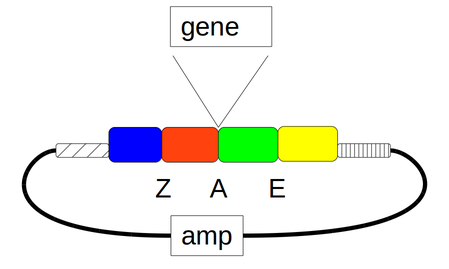

# Construction of pYPKa_A_{insert}

This notebook describe the construction of the _E. coli_ vector [pYPKa_A_{insert}](pYPKa_A_{insert}.gb)
with an insert for which PCR primers are also designed.

The insert defined below is cloned in pYPKa using the blunt restriction 
enzyme [AjiI](http://rebase.neb.com/rebase/enz/AjiI.html). The vector will be 
used to PCR amplify a gene to be cloned between a promoter and a terminator 
in a single gene expression construct.

The [pydna](https://pypi.python.org/pypi/pydna/) package is imported in the code cell below. 
There is a [publication](http://www.biomedcentral.com/1471-2105/16/142) describing pydna as well as
[documentation](http://pydna.readthedocs.org/en/latest/) available online. 
Pydna is developed on [Github](https://github.com/BjornFJohansson/pydna). 

    from pydna.readers import read
    from pydna.parsers import parse
    from pydna.parsers import parse_primers
    from pydna.design import primer_design
    from pydna.amplify import pcr
    from pydna.amplify import Anneal
    

The vector backbone [pYPKa](pYPKa.gb) is read from a local file.

	pYPKa = read("pYPKa.gb")

The restriction enzyme is imported from [Biopython](http://biopython.org)

	from Bio.Restriction import AjiI

The plasmid is linearized with the enzyme.

	pYPKa_AjiI  = pYPKa.linearize(AjiI)

The insert sequence is read from a [local file]({insert}.gb). This sequence was parsed from the ypkpathway data file.

	ins = read("{insert}.gb")

Primers are needed to PCR amplify the insert. The forward primer adds two adenines in front of the start codon
which is a feature commonly found in highly expressed _S. cerevisiae_ genes.

	fp_tail = "AA"

Primers are designed in the code cell below.

    ins = primer_design(ins)
    fp = fp_tail + ins.forward_primer
    rp = ins.reverse_primer

The primers are included in the [new_primer.txt](new_primers.txt) list and in the end of the [pathway notebook](pw.ipynb) file.

    print(fp.format("fasta"))
    print(rp.format("fasta"))
    with open("new_primers.txt", "a+") as f:
        f.write(fp.format("fasta"))
        f.write(rp.format("fasta"))

The gene is amplifed using the newly designed primers.

	ins = pcr(fp, rp, ins)

The PCR product has this length in bp.

	len(ins)

Primers anneals on template in the figure below.

	ins.figure()

A suggested PCR program.

	ins.program()

The final vector is:

	pYPKa_A_{insert} = (pYPKa_AjiI  + ins).looped().synced(pYPKa)

The vector with reverse insert is created below. This vector theoretically make up
fifty percent of the clones. The PCR strategy below is used to identify the correct clones.

	pYPKa_A_{insert}b = (pYPKa_AjiI  + ins.rc()).looped().synced(pYPKa)

A combination of standard primers and the newly designed primers are 
used for the strategy to identify correct clones.
Standard primers are listed [here](standard_primers.txt).
The standard primers are read into a dictonary in the code cell below.

	p = {{ x.id: x for x in parse_primers("standard_primers.txt") }}

## Diagnostic PCR confirmation of pYPKa_A_{insert}
The correct structure of pYPKa_A_{insert} is confirmed by PCR using standard primers
577 and 342 that are vector specific together with the {insert}fw primer specific for the insert 
in a multiplex PCR reaction with three primers present in the PCR reaction.

Two PCR products are expected if the insert was sucessfully cloned, sizes depending
on the orientation of the insert. 
If the vector is empty, only one short product is formed.

## Expected PCR products sizes:

pYPKa_A_{insert} with insert in correct orientation.

	Anneal( (p['577'], p['342'], fp), pYPKa_A_{insert}).products

pYPKa_A_{insert} with insert in reverse orientation.

	Anneal( (p['577'], p['342'], fp), pYPKa_A_{insert}b).products

Empty clone

	Anneal( (p['577'], p['342'], fp), pYPKa).products

The cseguid checksum for the resulting plasmid is calculated for future reference.
The [cseguid checksum](http://pydna.readthedocs.org/en/latest/pydna.html#pydna.utils.cseguid) 
uniquely identifies a circular double stranded sequence.

	pYPKa_A_{insert}.cseguid()

The file is given a name based on the cloned insert

	pYPKa_A_{insert}.locus = "pYPKa_A_{insert}"[:16]

Sequence is stamped with the cseguid checksum. 
This can be used to verify the integrity of the sequence file.

	pYPKa_A_{insert}.stamp()

The sequence is written to a local file.

	pYPKa_A_{insert}.write("pYPKa_A_{insert}.gb")

# Download [pYPKa_A_{insert}](pYPKa_A_{insert}.gb)

	import pydna
	reloaded = read("pYPKa_A_{insert}.gb")
	reloaded.verify_stamp()
 
