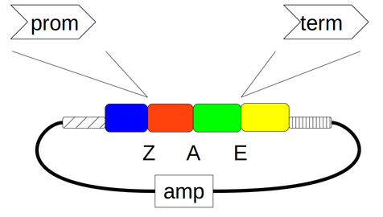

#Construction of promoter vector pYPKa_Z_{tp} and terminator vector pYPKa_E_{tp}

This notebook describe the construction of E. coli vectors [pYPKa_Z_{tp}](pYPKa_Z_{tp}.gb) and [pYPKa_E_{tp}](pYPKa_E_{tp}.gb)
with an insert for which PCR primers are also designed.

The insert defined below is cloned in pYPKa using the blunt restriction 
enzymes [ZraI](http://rebase.neb.com/rebase/enz/ZraI.html) and [EcoRV](http://rebase.neb.com/rebase/enz/EcoRV.html) in 
two different plasmids. The insert cloned in ZraI will be used as a promoter, while in the EcoRV site it will be used as a 
terminator.

The [pydna](https://pypi.python.org/pypi/pydna/) package is imported in the code cell below. 
There is a [publication](http://www.biomedcentral.com/1471-2105/16/142) describing pydna as well as
[documentation](http://pydna.readthedocs.org/en/latest/) available online. 
Pydna is developed on [Github](https://github.com/BjornFJohansson/pydna). 

	import pydna

The vector backbone pYPKa is read from a local [file](pYPKa.gb).

	pYPKa = pydna.read("pYPKa.gb")

Both restriction enzymes are imported from [Biopython](http://biopython.org/wiki/Main_Page)

	from Bio.Restriction import ZraI, EcoRV

The vector is cut with both enzymes.

	pYPKa_ZraI  = pYPKa.linearize(ZraI)
	pYPKa_EcoRV = pYPKa.linearize(EcoRV)

The insert sequence is read from a local file. This sequence was parsed from the ypkpathway data file.

	ins = pydna.read("{tp}.gb")

The insert sequence is read from a local file]. This sequence was parsed from the ypkpathway data file.

	fp_tail = "ttaaat"
	rp_tail = "taattaa"

Design primers for the terminator promoter. The primers has specific tails in order to produce 
a [SmiI](http://rebase.neb.com/rebase/enz/SmiI.html) and a [PacI](http://rebase.neb.com/rebase/enz/PacI.html) restriction site in the EcoRV cloning position.

	fp, rp = pydna.cloning_primers(ins, fp_tail=fp_tail, rp_tail=rp_tail)

Primers are given the names below. These primers are included in the primer list in the end of the [pathway notebook](pw.ipynb) file.

	fp.id = "{tp}fw"
	rp.id = "{tp}rv"

	print(fp.format("tab"))

	print(rp.format("tab"))

PCR to create the insert using the newly designed primers.

	prd = pydna.pcr(fp, rp, ins)

The PCR product has this length in bp.

	len(prd)

A figure of the primers annealing on template.

	prd.figure()

A suggested PCR program.

	prd.program()

The final vectors are:

	pYPKa_Z_{tp} = (pYPKa_ZraI  + prd).looped().synced(pYPKa)
	pYPKa_E_{tp} = (pYPKa_EcoRV + prd).looped().synced(pYPKa)

The final vectors with reverse inserts are created below. These vectors theoretically make up
fifty percent of the clones. The PCR strategy below is used to identify the correct clones.

	pYPKa_Z_{tp}b = (pYPKa_ZraI  + prd.rc()).looped().synced(pYPKa)
	pYPKa_E_{tp}b = (pYPKa_EcoRV + prd.rc()).looped().synced(pYPKa)

A combination of standard primers and the newly designed primers are 
used for the strategy to identify correct clones.
Standard primers are listed [here](primers.fasta).

	p = {{ x.id: x for x in pydna.parse("primers.fasta") }}

##Diagnostic PCR confirmation

The correct structure of pYPKa_Z_{tp} is confirmed by PCR using standard primers
577 and 342 that are vector specific together with the {tp}fw primer specific for the insert 
in a multiplex PCR reaction with 
all three primers present.

Two PCR products are expected if the insert was cloned, the sizes depend 
on the orientation. If the vector is empty or contains another insert, only one
product is formed.

####Expected PCR products sizes from pYPKa_Z_{tp}:

pYPKa_Z_{tp} with insert in correct orientation.

    pydna.Anneal( (p['577'], p['342'], fp), pYPKa_Z_{tp}).products

pYPKa_Z_{tp} with insert in reverse orientation.

    pydna.Anneal( (p['577'], p['342'], fp), pYPKa_Z_{tp}b).products

Empty pYPKa clone.

    pydna.Anneal( (p['577'], p['342'], fp), pYPKa).products

####Expected PCR products sizes pYPKa_E_{tp}:

pYPKa_E_{tp} with insert in correct orientation.

    pydna.Anneal( (p['577'], p['342'], fp), pYPKa_E_{tp}).products

pYPKa_E_{tp} with insert in reverse orientation.

    pydna.Anneal( (p['577'], p['342'], fp), pYPKa_E_{tp}b).products

Calculate cseguid checksums for the resulting plasmids for future reference.
Cseguid is a checksum that uniquely describes a circular double stranded 
sequence.

	print(pYPKa_Z_{tp}.cseguid())
	print(pYPKa_E_{tp}.cseguid())

The sequences are named based on the name of the cloned insert.

	pYPKa_Z_{tp}.locus = "pYPKa_Z_{tp}"[:16]
	pYPKa_E_{tp}.locus = "pYPKa_Z_{tp}"[:16]

Stamp sequence with cseguid checksum. This can be used to verify the 
integrity of the sequence file.

	pYPKa_Z_{tp}.stamp()
	pYPKa_E_{tp}.stamp()

Sequences are written to local files.

	pYPKa_Z_{tp}.write("pYPKa_Z_{tp}.gb")
	pYPKa_E_{tp}.write("pYPKa_E_{tp}.gb")

#[Download](pYPKa_Z_{tp}.gb)

	import pydna
	reloaded = pydna.read("pYPKa_Z_{tp}.gb")
	reloaded.verify_stamp()

#[Download](pYPKa_E_{tp}.gb)

	import pydna
	reloaded = pydna.read("pYPKa_E_{tp}.gb")
	reloaded.verify_stamp()

